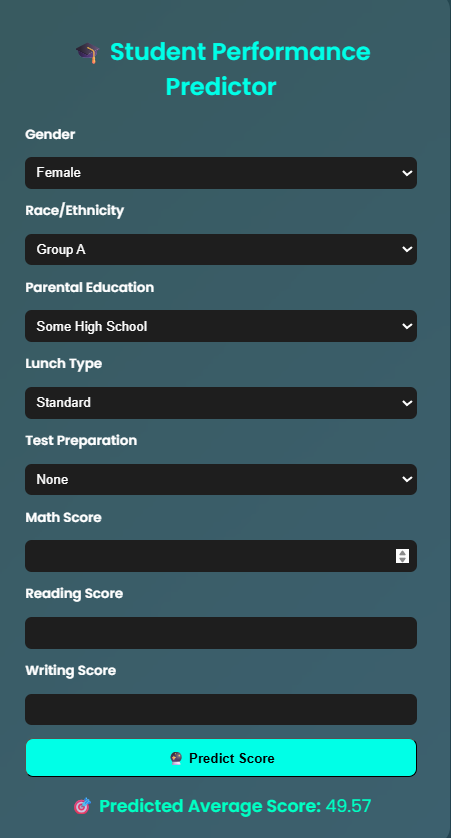

# 🎓 Student Performance Prediction ML Web App

An end-to-end machine learning project that predicts student performance based on demographic, socioeconomic, and academic features. Built with **Flask**, styled using **HTML/CSS**, and powered by a trained **ML model**.

---

## 📸 Demo Screenshot



---

## 🚀 Getting Started

To run the project locally:

```bash
git clone https://github.com/yourusername/student-performance-predictor.git
cd student-performance-predictor

python -m venv venv
venv\Scripts\activate   

pip install -r requirements.txt

python app.py
🖥 Open in browser: http://127.0.0.1:5000

📂 Project Structure

student-performance-predictor/
├── app.py
├── requirements.txt
├── README.md
├── .gitignore
├── model/
│   ├── student_score_model.pkl
│   └── encoders.pkl
├── Data/
│   └── StudentsPerformance.csv
├── Src/
│   ├── train.py
│   ├── preprocessing.py
│   └── predict.py
├── templates/
│   └── index.html
├── static/
│   └── style.css
├── Notebooks/
│   └── eda_modeling.ipynb

💡 Features
📋 Input: Gender, Race, Parental Education, Lunch, Test Preparation & Scores

🔍 Output: Predicted Average Score using ML Model

🧼 Preprocessing with LabelEncoder

🖥️ Simple and clean web interface using Flask

📈 ML Model Info
Algorithm: Linear Regression

Libraries: scikit-learn, pandas, numpy, joblib

Encoders: Saved as encoders.pkl

Target Variable: Average of Math, Reading, Writing Scores

✅ Sample Output
Predicted Student Score: 49.57

📦 Dependencies
Flask

scikit-learn

pandas

numpy

joblib

Abhinav Jangid
🎓 B.Tech CSE (AI/ML)
🔗 LinkedIn Profile: https://www.linkedin.com/in/abhinav-jangid22/

🌟 Show Some Love!
If you found this project helpful, please consider starring ⭐ the repository!
